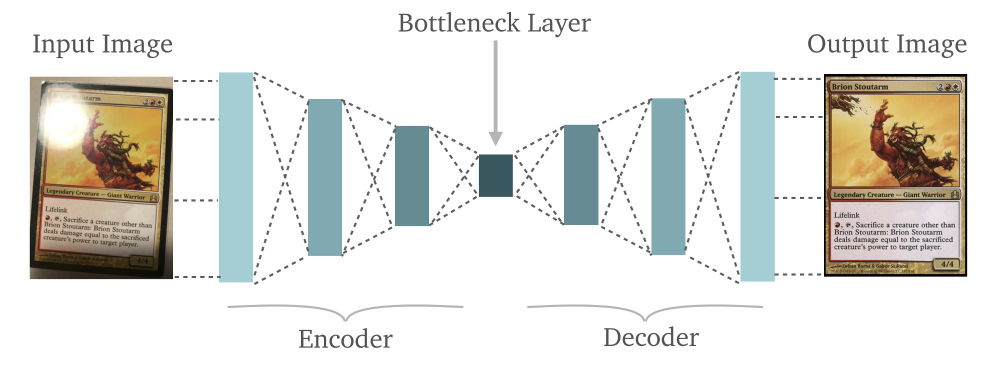

# Denoising Autoencoders
## Introduction
In this lesson we will look at Denoising Autoencoders (DAEs). A DAE is a specific type of autoencoder, which is generally implemented as a deep neural network, similar to the example we saw in our previous lesson. The denoising autoencoder is trained to use a hidden layer to reconstruct a particular model based on its inputs. . 

## Objectives
You will be able to:
- Understand and Explain De-noising Autoencoders
- Different between the applications of a datacompression vs. denoising AE

## DAE - In a Nutshell

__Denoising Autoencoders attempt to learn a representation of input data that is robust to the introduction of noise__

So far, we have seen in this section that autoencoders work on the premise of __reconstructing__ model inputs as  unsupervised machine learning algorithms, deriving results from unstructured data.

To achieve the reconstruction, i.e. matching target outputs to inputs, a DAE takes in a __corrupted__ version of some model, and tries to reconstruct a __clean__ model using de-noising techniques. 

> With DAEs, We can apply noise in a particular amount as a percentage of the model and try to force the hidden layer to work from the corrupted version to produce a clean version. 

Multiple DAEs can also be stacked on each other to provide iterative learning toward this key goal.

In our previous lessons, we looked at simple and deep AEs to compress and reduce dimensionality of data. DAEs, on the other hand, are used for noise removal. Imagine a set of low quality images with some noise. Looking at the image above, we can go ahead and try to reproduce a clear image, removing the noise learned by the model. This allows automatic image cleaning, similar to noise removal features offered by leading image processing softwares like Adobe Photoshop. 

Here is a quick of example of what you may be able to achieve in terms of getting a clean image. These results have been achoieved using a deep denoising convolutional autoencoder, as shown in [this article](https://hackernoon.com/a-deep-convolutional-denoising-autoencoder-for-image-classification-26c777d3b88e)

Deep learning with large high-def images is one of the most computationally expensive tasks that data scientists and machine learning engineers come across. Common practices to deal with such requirements are a) employ GPU processing, b) use cluster. 

For our experiment, we shall stick with MNIST type small datasets. All the labs can be repeated with suggested larger datasets. On your normal PC/laptop, running a detailed computer vision related machine learning experiment may take hours, or even days (depending on the size of dataset and resolution in images contained within). Our lessons and accompanying labs will focus on explaining the principles behind approaches and coding practices that may later be scaled up to learn larger experiments. 

## Additional Resources
[Youtube: Denoising Autoencoders](https://www.youtube.com/watch?v=t2NQ_c5BFOc) Denoising autoencoders explained with a pratical example

## Summary 

In this lesson, we looked at how DAEs differ from AEs in terms of their application area. Next, we shall apply this idea of a small image dataset and inspect the noise removal capabilities of DAEs. 
